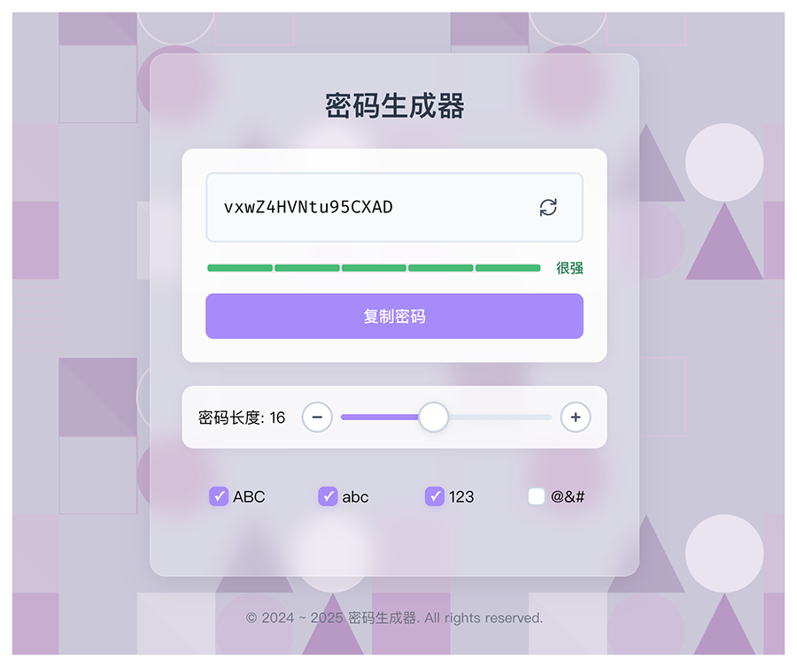

# 密码生成器

一个现代化的在线密码生成器，帮助用户快速生成安全、强度可控的随机密码。

## 🌐 在线预览

**[👉 立即体验](https://chenzhenyuan.com/products/password-generator/)**

## 📸 预览



## ✨ 功能特性

### 核心功能
- **随机密码生成** - 使用加密安全的随机算法生成密码
- **自定义长度** - 支持 4-32 位密码长度，通过滑块或按钮调节
- **字符类型选择** - 灵活组合以下字符类型：
  - 大写字母 (A-Z)
  - 小写字母 (a-z)
  - 数字 (0-9)
  - 特殊符号 (~!@#$%&_-+[].<>)
- **密码强度评估** - 实时显示密码强度等级（很弱/较弱/中等/较强/很强）
- **一键复制** - 快速复制生成的密码到剪贴板
- **动画效果** - 密码生成时的炫酷滚动动画
- **设置持久化** - 自动保存用户偏好设置到本地存储

### 智能特性
- **首字符保护** - 首字符不会是特殊符号，确保兼容性
- **符号分散** - 当选择多种字符类型时，避免特殊符号连续出现
- **最少选择限制** - 至少保留一种字符类型，防止无法生成密码
- **实时更新** - 修改任何设置后自动重新生成密码

### 用户体验
- **响应式设计** - 完美适配桌面和移动设备
- **几何背景动画** - 动态几何图形背景增强视觉效果
- **直观操作** - 简洁清晰的用户界面
- **即时反馈** - 复制成功提示、强度颜色指示

## 🛠️ 技术栈

- **框架**: React 18.2
- **语言**: TypeScript 5.2
- **构建工具**: Vite 5.2
- **样式**: Sass/SCSS Modules
- **状态管理**: React Hooks (useState, useEffect, useMemo, useCallback)

## 📦 项目结构

```
password-generator/
├── src/
│   ├── components/
│   │   ├── Generator/           # 密码生成器主组件
│   │   │   ├── components/      # 子组件
│   │   │   │   ├── PasswordDisplay.tsx    # 密码显示组件
│   │   │   │   └── StrengthMeter.tsx      # 强度指示器
│   │   │   ├── hooks/           # 自定义 Hooks
│   │   │   │   ├── usePasswordGenerator.ts    # 密码生成逻辑
│   │   │   │   ├── usePasswordSettings.ts     # 设置管理
│   │   │   │   └── useScrambleAnimation.ts    # 滚动动画
│   │   │   ├── utils/           # 工具函数
│   │   │   │   └── passwordStrength.ts        # 强度计算
│   │   │   ├── CheckboxOption.tsx             # 复选框组件
│   │   │   └── index.tsx                      # 主入口
│   │   └── Geometric/           # 几何背景组件
│   ├── styles/
│   │   └── global.css           # 全局样式
│   ├── App.tsx                  # 应用根组件
│   └── main.tsx                 # 应用入口
├── index.html                   # HTML 模板
├── package.json                 # 依赖配置
├── tsconfig.json                # TypeScript 配置
└── vite.config.ts               # Vite 配置
```

## 🚀 快速开始

### 环境要求
- Node.js >= 16
- npm 或 yarn

### 安装依赖
```bash
yarn install
# 或
npm install
```

### 开发模式
```bash
yarn dev
# 或
npm run dev
```
访问 http://localhost:5173

### 构建生产版本
```bash
yarn build
# 或
npm run build
```
构建产物输出到 `dist/` 目录

### 预览生产版本
```bash
yarn preview
# 或
npm run preview
```

## 💡 使用说明

1. **调整密码长度**
   - 拖动滑块或点击 +/- 按钮设置密码长度（4-32位）

2. **选择字符类型**
   - 勾选需要的字符类型（大写、小写、数字、符号）
   - 至少保留一种字符类型

3. **生成密码**
   - 修改设置后自动生成新密码
   - 点击刷新图标手动重新生成

4. **查看强度**
   - 密码下方显示强度等级和颜色指示
   - 强度评估基于长度和字符类型多样性

5. **复制密码**
   - 点击"复制密码"按钮
   - 成功后显示"复制成功 ✓"提示


## 🔒 安全性

- 使用 `Math.random()` 生成随机字符（适用于一般用途）
- 密码生成完全在客户端进行，不会上传到服务器
- 不存储生成的密码，仅保存用户设置偏好
- 建议生成的密码用于个人账户，敏感场景请使用专业密码管理器


## 📸 预览


<!-- 
## 🎨 密码强度算法

强度评估基于以下因素：
- **长度**: 8位以下为弱，8-12位中等，12-16位较强，16位以上很强
- **字符多样性**: 使用的字符类型越多，强度越高
- **特殊规则**: 
  - 仅使用单一字符类型：很弱
  - 仅使用大小写字母：很弱
  - 长度不足8位：很弱
-->


## 📄 许可证

MIT License - 详见 [LICENSE](./LICENSE) 文件

## 🤝 贡献

欢迎提交 Issue 和 Pull Request！

## 📧 联系方式

如有问题或建议，请通过 Issue 联系。
